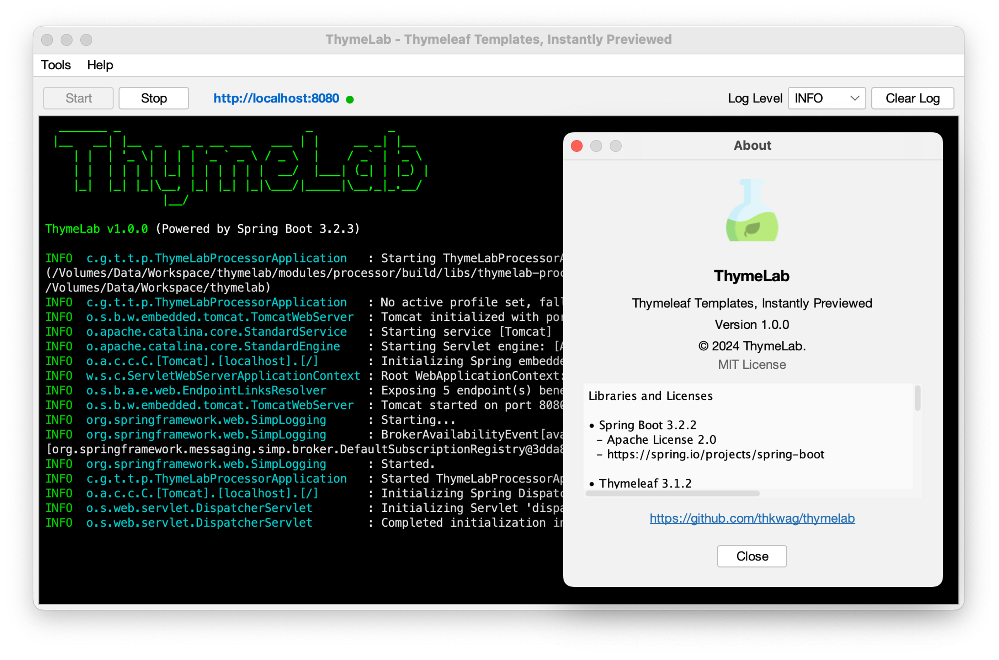
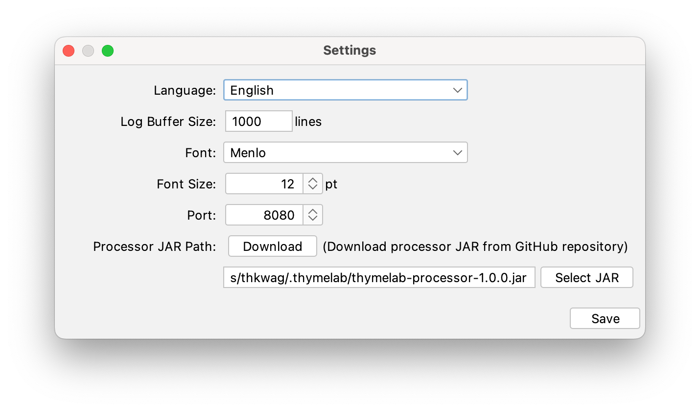
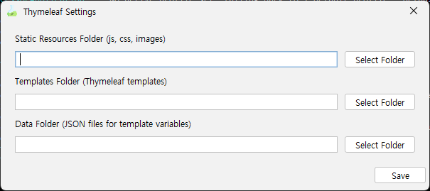
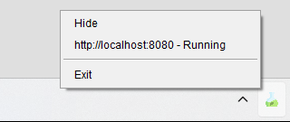

# ThymeLab Launcher

ThymeLab Launcher is a desktop application that provides a user-friendly interface for running and managing the ThymeLab Processor. It eliminates the need for manual Java environment setup and command-line operations.

<p align="center">
   
</p>

## Features

### Easy Setup and Operation
- **One-Click Installation**: Simple installer for Windows and macOS
- **No Java Setup Required**: Bundled JVM eliminates manual Java environment configuration
- **Visual Directory Configuration**: Easy setup of template, static resource, and data directories
- **Server Control**: Start/stop processor with a single click
- **Port Configuration**: Customize server port through UI

### Real-time Monitoring
- **Live Log Display**: View processor logs in real-time
- **Log Level Control**: Adjust log detail level on the fly
- **Log Buffer Management**: Configure log history size
- **Clear Log Function**: Clean log display with one click

### User Interface
- **System Tray Integration**: Quick access to common functions
- **Modern UI**: Clean interface with FlatLaf theme
- **Internationalization**: English and Korean language support
- **Font Customization**: Adjustable log display font and size

## Installation & Running

### Windows

#### Option 1: Using Installer (Recommended)
1. Download `ThymeLab-x.x.x.exe` from the latest release
2. Run the installer
3. Follow the installation wizard
   - Choose installation directory
   - Create desktop shortcut (optional)
   - Create start menu shortcuts (optional)
4. Launch from:
   - Start Menu: ThymeLab
   - Desktop shortcut (if created)
   - Installation directory: `ThymeLab.exe`

#### Option 2: Portable ZIP
1. Download `thymelab-x.x.x.zip`
2. Extract to desired location
3. Run `thymeLab-launcher-x.x.x.jar`:
   - Double-click the JAR file
   - Or via command line:
     ```bash
     java -jar thymeLab-launcher-x.x.x.jar
     ```

### macOS

#### Option 1: Building Installer
Due to Apple Developer ID requirements, macOS users need to build the installer:
1. Clone the repository:
   ```bash
   git clone https://github.com/thkwag/thymelab.git
   cd thymelab
   ```
2. Build installer:
   ```bash
   ./gradlew createInstaller -Pos=mac
   ```
3. Find installer in `build/dist/`
4. Run the installer
5. Launch from:
   - Applications folder
   - Spotlight: ThymeLab
   - Command line: `open -a ThymeLab`

#### Option 2: Portable ZIP
1. Download `thymelab-x.x.x.zip`
2. Extract to desired location:
   ```bash
   unzip thymelab-x.x.x.zip
   cd thymelab-x.x.x
   ```
3. Run the launcher:
   ```bash
   java -jar thymeLab-launcher-x.x.x.jar
   ```

### Linux

#### Using Portable ZIP
1. Download `thymelab-x.x.x.zip`
2. Extract and run:
   ```bash
   unzip thymelab-x.x.x.zip
   cd thymelab-x.x.x
   java -jar thymeLab-launcher-x.x.x.jar
   ```

#### Creating Desktop Entry (Optional)
1. Create `thymelab.desktop`:
   ```ini
   [Desktop Entry]
   Type=Application
   Name=ThymeLab
   Comment=ThymeLab Launcher
   Exec=java -jar /path/to/thymeLab-launcher-x.x.x.jar
   Icon=/path/to/thymelab/resources/icons/icon.png
   Terminal=false
   Categories=Development;
   ```
2. Move to applications directory:
   ```bash
   mv thymelab.desktop ~/.local/share/applications/
   ```

### System Requirements

#### Windows
- Windows 10/11 (64-bit)
- No Java installation required (bundled JVM)

#### macOS
- macOS 10.14+ (Mojave or later)
- No Java installation required (bundled JVM)

#### Linux
- Modern Linux distribution (Ubuntu 20.04+, Fedora 34+, etc.)
- Java 17 or later required

## Quick Start Guide

1. **First Launch**
   - Start ThymeLab using the appropriate method for your OS
   - The main window shows server status and log display

2. **Configure Directories**
   - Click Settings in the menu
   - Set paths for:
     - Templates Directory (Thymeleaf templates)
     - Static Resources Directory (CSS, JS, images)
     - Data Directory (JSON files)

3. **Start Development**
   - Click Start to run the processor
   - Open `http://localhost:8080` in your browser
   - Edit templates and see changes in real-time

## Settings

### Program Settings
- **Language**: Switch between English, Korean, and Japanese
- **Log Buffer**: Set maximum log lines to display
- **Font**: Customize log display font
- **Font Size**: Adjust log text size
- **Port**: Change server port (default: 8080)
- **Processor JAR**: Configure or download processor JAR
  - Download from GitHub releases
  - Select local JAR file
<p align="center">
   
</p>

### Thymeleaf Settings
- **Static Resources**: Location of web resources (js, css, images)
- **Templates**: Location of Thymeleaf template files (.html)
- **Data**: Location of JSON data files for template variables
<p align="center">
   
</p>

### Log Level Control
- Set logging detail level from toolbar:
  - ERROR
  - WARN
  - INFO
  - DEBUG

## System Tray Features
- Minimize to system tray
- Show/hide main window
- Exit application
<p align="center">
   
</p>

## Integration with ThymeLab Processor
- Automatically manages processor lifecycle
- Provides real-time log feedback
- Handles configuration changes
- Ensures proper startup and shutdown

## Support
For issues and questions, please create an issue in the GitHub repository. 